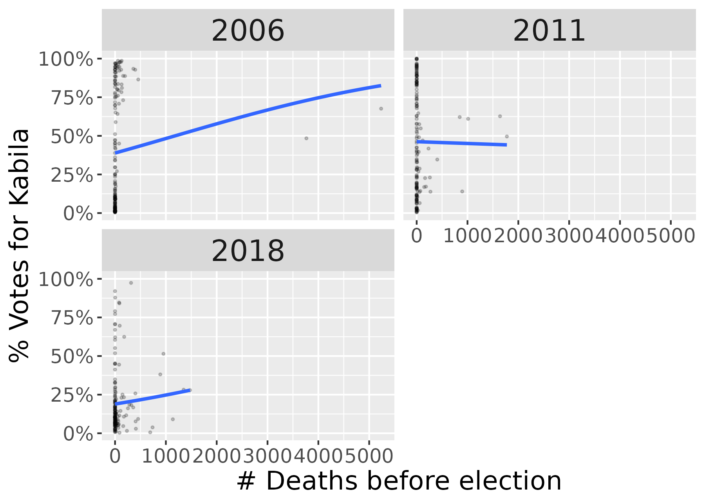

## Large File Storage Support

This project uses git large file storage to store the nightlight data. Please, 
make sure that support for git large file storage is installed before cloning it. 
Please check for more information at 
https://docs.github.com/en/repositories/working-with-files/managing-large-files

## Preprocessing

The preprocessing script (R/001 - data processing) is designed to meticulously 
prepare election data spanning three different years—2006, 2011, and 2018—for 
subsequent analysis. Given the diverse nature of the data sources and the specific 
requirements of electoral studies, this section employs a series of detailed 
steps to ensure data consistency, accuracy, and usability. The primary focus is 
on handling discrepancies across datasets, normalizing data structures, and 
creating a unified framework that supports robust and comprehensive analysis.

The data preprocessing involves several key steps:

1. **Data Reading and Cleaning**: This step includes importing data from various 
Excel files, removing irrelevant rows and columns, and merging datasets where 
necessary. Specific adjustments are made to handle unique identifiers and ensure 
alignment across different datasets.
2. **Column Renaming and Nesting**: The data is reorganized to nest information 
about candidates and votes in a structured format. This involves standardizing 
column names for consistency and clarity across the datasets from different years.
3. **Geographic Organization and Indexing**: Election data is indexed and nested 
by geographic and administrative divisions, such as provinces, cities, and 
constituencies. This step addresses inconsistencies in geographic names and ensures 
that data is uniformly formatted for easier comparison.
4. **Data Matching Across Elections**: A multi-step process is implemented to 
match geographic names across different years, accommodating variations in naming 
conventions and ensuring that data can be accurately compared.
5. **Data Merging**: Utilizing the established indexes, datasets from different 
years are merged to create a comprehensive view that supports longitudinal analysis.
6. **Derived Quantities Calculation**: This involves estimating and aggregating 
registered voters, total votes, and specific candidate votes across various 
administrative levels, enhancing the dataset's analytical depth.
7. **Geographic Harmonization**: Geographic data is aligned with the electoral 
dataset, ensuring consistency in spatial analysis. Distances 
(as log10(distance in km)) from each administrative unit to the Uganda and Rwanda 
border are computed. Distances (as log10(distance in km)) from each territory 
centroid to each candidate's home territory are computed.
8. **Conflict Data Integration**: Conflict data (UCDP and ACLED) is integrated to provide a 
contextual understanding of the election periods, categorized by types of 
violence and involved parties.
9. **Nightlight Data Analysis**: Nightlight data is processed to analyze trends 
over time, providing additional context for the electoral analysis.

Each of these steps is critical in transforming raw election data into a 
structured and analyzable format, facilitating a thorough and nuanced 
understanding of electoral trends and patterns.

### 1-READ DATA

 This section processes and combines election data from different years to prepare 
 it for further analysis. Specifically, it handles data from the years 2006, 2011, 
 and 2018, sourced from multiple Excel files.
 
 **2006 Data**: The script reads two sets of data for 2006. The first dataset 
 (```data/2006first_round.xlsx```) is filtered to remove rows representing provincial 
 totals and related columns are excluded. The second dataset (```data/2006clean.xlsx```), 
 labeled as second round, undergoes a similar cleaning process. 
 These datasets are then merged based on the Territoire/ville column.
 
 **2011 Data**: Data from the 2011 elections (```data/2011drc_election_all_clcr_cleaned_stata.xlsx```) 
 is read and rows containing aggregated totals are excluded.
 
 **2018 Data**: The script first reads the primary dataset for 2018 (```data/prs_edited.xlsx```). 
 It then reads a separate file containing candidate names and IDs (```data/RESULTAT-PRESIDENTIEL-1.xlsx```), 
 which are necessary to match candidate details correctly across different datasets. 
 Due to discrepancies in candidate IDs between different sources, the script includes a 
 manual mapping of IDs ```("1001_44_10"="20","1001_48_14"="4","1001_84_158"="13")``` 
 to align them correctly based on a comparison with the original data source. 
 Once the IDs are aligned, the candidate details are merged into the main 2018 dataset.

### 2-RENAME COLUMNS AND NEST VOTES FOR EACH CANDIDATE

 This section processes election data from 2006, 2011, and 2018 to structure and 
 organize key information regarding electoral votes and participants. Specifically, 
 it performs the following operations:
   
 1. For the year 2006, it restructures the data to list each candidate along with 
 the percentage and calculated number of votes they received. This transformation 
 involves pivoting the dataset so that candidate names and their corresponding 
 vote percentages are collated into a nested data frame, which includes both the 
 candidate names and the calculated votes based on valid votes and participation percentages.
 
 2. For the years 2011 and 2018, the script formats the data by nesting details 
 about each candidate’s votes into a similar structured format. This includes 
 renaming certain columns for consistency and clarity, such as the candidate’s 
 name and the number of votes they received.
 
 3. Additionally, the script standardizes other important electoral information 
 across the datasets for these years, such as the number of registered voters, 
 actual voters, ballot boxes, and the count of processed ballot boxes. This renaming 
 ensures uniformity across different election years for easier comparison and analysis.
 
 Overall, this section enhances the accessibility and usability of election data 
 by organizing it into a consistent format across different election years, 
 allowing for streamlined analysis and reporting.
 
### 3-NEST DATA BY LOCATION AND STANDARDIZE INDEXES

 This section focuses on organizing and indexing election data from 2006, 2011, 
 and 2018 by geographic and administrative divisions such as provinces, cities, 
 and electoral constituencies. It aims to facilitate easier data comparison and 
 analysis across different election years:
   
 1. **Nesting and Index Creation**: The script nests voting site data within 
 each constituency for the 2018 dataset. For all years, it establishes indexes 
 based on geographic identifiers like city names and constituency names, which 
 are standardized to lower case and stripped of extra spaces for uniformity.
 
 2. **Labeling and Manual Adjustments**: The script also assigns labels to each 
 entry for clearer identification and resolves inconsistencies in geographic names 
 between datasets. In Kinshasa, for example, it adjusts city names to subprovince 
 levels to match data granularity in other years.
 
 3. **Data Matching and Structuring**: Efforts are made to align the datasets by 
 manually correcting discrepancies in geographic names across the election years. 
 This includes both simplifying and matching names and ensuring that the names 
 used reflect the administrative changes or differences noted in different datasets.
 
 4. **Nested Structuring**: Finally, the data is restructured into nested formats 
 based on updated indexes and labels. This allows for detailed yet manageable 
 data subsets, which can be used for in-depth regional analysis or aggregated to 
 provide broader electoral insights.
 
 This meticulous organization of data by location enhances the analytical framework, 
 making it easier to track electoral trends and patterns across different regions 
 and election cycles.
 
### 4-MATCH DATA ACROSS ELECTIONS

 This section is dedicated to matching election data across three different election 
 years: 2006, 2011, and 2018. The primary challenge addressed here is the discrepancies 
 in geographical names across different datasets, particularly because some regions 
 like Kinshasa lack detailed geographic identifiers in some years. To tackle this, 
 a multi-step matching strategy is implemented:
 
 1. **Initial Extraction and Naming**: The script extracts names of cities or 
 constituencies (referred to as villes/circonscriptions) from each year's dataset 
 and assigns them as names to character vectors. This approach uses the 
 names of these vectors for matching, ensuring that the actual content remains unchanged.
 
 2. **Iterative Matching Process**: The matching process involves several iterative 
 steps where the names in the vectors are slightly modified in each iteration to 
 accommodate differences in naming conventions between datasets. For example, 
 the term "ville" is removed and excess whitespace is cleaned to improve matching accuracy.
 
 3. **Compilation of Matched and Unmatched Names**: After each matching attempt, 
 matched names are compiled, and unmatched names undergo further processing to 
 refine their format and attempt another match. This stepwise refinement continues 
 until no further matches can be found.
 
 4. **Final Data Structuring**: The results are then structured into a comprehensive 
 list that captures both matched and unmatched names, ensuring that data from different 
 years can be compared accurately despite initial discrepancies.
 
 The process is meticulous and aims to ensure that electoral data from different 
 years can be aligned and analyzed consistently, addressing challenges posed by 
 changes in geographic names and administrative boundaries over time.

Details: There are some missing Circonscriptions in 2011. At Kinshasa, because we don't have 
enough detail in 2011 data, we are limited to use the subprovince level.
The strategy followed is to extract the names of the villes/circonscriptions into 
a named character vector. Matching is done in several steps because there are 
differences across elections in the way the villes are named.
First, the names of the vector are set equal to the vector contents. 
We will use the names and not the contents to match the villes across elections. 
In each step trying to match the data, we modify the names of the vector, 
leaving the vector contents untouched.That way, in the end, we have an index of 
villes matches across elections, even if the actual names are different.


### 5-MERGE DATA ACROSS ELECTIONS

 This section consolidates election data from different years (2006, 2011, and 2018) 
 using previously created matching indexes to ensure consistency and continuity 
 across datasets. The primary activities in this process include:

 1. **Data Preparation**: Indexes that have been aligned in previous steps are 
 used to merge data across the election years. This ensures that each entry from 
 different years corresponds to the same geographic location or administrative 
 division, even when direct matches in names are not apparent.

 2. **Merging Process**: The script performs several full joins to combine the 
 datasets from 2006, 2011, and 2018 based on these indexes. This method allows 
 for the inclusion of all available data, whether or not a direct match exists 
 in all three years, thus preserving the maximum possible data granularity.

 3. **Final Structuring and Cleaning**: Once merged, the data is restructured to 
 create a unified view that includes labels and province names standardized across 
 years. This structuring is crucial for analyses that require consistent geographic 
 identifiers across multiple election cycles.

 4. **Variable Cleanup and Data Saving**: Unnecessary variables are removed to 
 tidy up the workspace, and the final structured dataset is arranged and saved 
 for further analysis or reporting.

 By integrating data from multiple election years, this section facilitates 
 comprehensive longitudinal electoral analyses, helping to identify trends and 
 changes over time within the same geographic locales.
 
### 6-DERIVED QUANTITIES

#### 6.1-REGISTERED VOTERS IN EACH LEVEL


 This section focuses on calculating the number of registered voters at various 
 administrative levels for each election year. The calculations are performed through 
 a series of nested data manipulations, leveraging the flexibility of functional 
 programming within R:

 1. **Data Transformation**: For each election dataset, the script navigates through 
 multiple nested structures—ranging from regions down to individual voting sites—to 
 calculate the number of registered voters based on the available data, such as 
 valid votes and participation percentages.

 2. **Voter Estimation (2006 only)**: Using the data on valid votes and the percentage of 
 participation, the script estimates the total number of registered voters at 
 different levels (e.g., circonscription, ville territoire) by reversing the 
 calculation of valid votes from participation rates.

 3. **Aggregation**: After obtaining the registered voters at the lowest levels, 
 these figures are summed up through the nested structures to provide total counts 
 at higher administrative levels, ensuring that each region’s total reflects all 
 underlying data.

 4. **Data Integration**: The computed totals of registered voters for each level 
 and year are then integrated back into the main dataset, providing enriched data 
 points that support more detailed electoral analysis.

 By systematically estimating and aggregating registered voter counts across 
 different levels, this section enhances the dataset's value for analyzing voter 
 turnout and electoral engagement across regions and election cycles.
 
#### 6.2-VOTERS IN EACH LEVEL

 This section is devoted to calculating the total number of voters 
 from election data spanning three different years: 2006, 2011, and 2018. Here's 
 an overview of how the data is processed:

 1. **Data Transformation**: For each election year, the data undergoes a series 
 of transformations to calculate the total voters within each administrative level, 
 such as circonscriptions and voting sites.

 2. **Nested Calculations**: The script navigates through nested structures 
 (circonscription to voting sites) to aggregate voters at various levels.

 3. **Summation and Aggregation**: After extracting the voters for smaller 
 units, the script sums these voters to compute total figures for larger geographic 
 or administrative areas. This aggregation helps in understanding the total voter 
 turnout and the distribution across different regions.

 4. **Data Integration and Unnesting**: The sums of voters are then integrated 
 back into the main dataset, ensuring that each administrative unit's total voters 
 are reflected in the final dataset.
 
#### 6.3-TOTAL VOTES IN EACH LEVEL


 This section of the script is dedicated to calculating the total number of valid votes 
 (referred to as "total votes") across different administrative levels for the 
 election years 2006, 2011, and 2018. Here’s a concise breakdown of the process:

 1. **Vote Calculation**:
    - For 2006, the script directly assigns the number of valid votes ('Votes valables') 
    from the data to a new column called 'total.votes' for each circonscription. 
    It then sums these votes to get a total count for each higher administrative level.
    - In 2011, the process involves extracting and summing votes from nested data 
    structures within each circonscription. This is slightly more complex as it 
    involves pulling and summing nested vote counts.
    - For 2018, the calculation is even more granular, extending down to voting 
    sites within each ville and territoire. This involves multiple layers of 
    mapping and summing to aggregate votes all the way up from the most detailed levels.

 2. **Data Aggregation**: After calculating the total votes at the lowest necessary 
 levels, the script aggregates these totals to provide comprehensive vote counts 
 for larger geographic or administrative areas.

 3. **Integration and Unnesting**: The aggregated total votes are then integrated 
 back into the main dataset.
 
#### 6.4-VOTES AND PERCENTAGE FOR KABILA IN EACH LEVEL

 This section of the script is dedicated to calculating the total votes and the 
 percentage of votes received by the candidate Kabila (and Ramazani in 2018) at 
 various administrative levels across the election years 2006, 2011, and 2018. 
 The method involves several steps:
 
 1. **Data Extraction**:
    - The votes specifically for Kabila (or Ramazani in 2018) are extracted from 
    nested data structures by filtering for the candidate's name within each voting 
    site or circonscription.
 
 2. **Vote Calculation**:
    - The valid votes for Kabila are aggregated first within the smallest units 
    (voting sites or circonscriptions) and then summed up to provide totals for 
    larger administrative areas.
 
 3. **Percentage Calculation**:
    - The percentage of votes received by Kabila or Ramazani is calculated by 
    dividing their total votes by the total votes of all candidates at each 
    administrative level. 
    - The calculation is done post-aggregation to ensure it reflects the comprehensive 
    vote share.
 
 4. **Data Aggregation and Unnesting**:
   - After calculating the total votes and percentages, these metrics are nested 
   back into the main dataset. Then nested lists are simplified into standard 
   columns for ease of analysis.
 
 5. **Result Integration**:
   - The final step involves integrating the calculated votes and percentages 
   into the main dataset, enhancing the dataset with key electoral metrics for 
   Kabila and Ramazani.
 
#### 6.5-BALLOT BOXES IN EACH LEVEL (2011,2018 ONLY)

 This section of the script processes and calculates the total number of ballot 
 boxes counted at various administrative levels during the 2011 and 2018 elections. 
 The approach involves multiple steps to ensure accurate aggregation of data:
 
 1. **Mapping and Summation**:
   - For each entry in the dataset, the script calculates the sum of ballot boxes 
   counted within each administrative unit, such as circonscriptions or voting sites.
   - This involves iterating over each circonscription and, for the 2018 data, 
 each ville.territoire within the circonscriptions, to aggregate the counts 
 from the smallest units upwards.
 
 2. **Data Aggregation**:
   - The aggregated counts of ballot boxes from the smaller units (voting sites 
   or circonscriptions) are further summed to provide totals for larger areas.
 
 3. **Flattening and Integration**:
   - The nested results are flattened to simplify the nested lists into a standard 
   column format within the main dataset.
 
 4. **Final Aggregation and Calculation**:
   - After processing individual entries, a final summation is performed across 
   all entries for each election year to calculate the total number of ballot 
   boxes counted across all circonscriptions.
    - The results are added to the dataframe, providing a clear overview of ballot 
 box distribution and availability during the elections.
 
#### 6.6-VOTING SITES WITH ZERO VOTERS (2018 ONLY)

 This section identifies and quantifies voting sites with zero voters from the 
 2018 election data. It performs the following operations:
   
 1. **Filtering Voting Sites**: The script navigates through multiple nested 
 data structures, filtering out voting sites where the number of voters is not 
 available.
 2. **Counting Voting Sites**: For each administrative level (e.g., circonscription, 
 ville.territoire), it counts the number of voting sites that reported zero voters.
 3. **Aggregating Data**: These counts are aggregated at higher administrative 
 levels, providing a comprehensive total of voting sites with zero voters for each level.
 4. **Data Integration**: The results are integrated back into the main dataset, 
 adding the total counts of zero-voter sites for further analysis and reporting.
 
#### 6.7-VOTES AND PERCENTAGES FOR OTHER CANDIDATES IN 2018

 This section calculates the total votes and percentages for the candidates 
 Fayulu and Tshisekedi in the 2018 election. The script performs the following 
 tasks:
   
   1. **Fayulu's Votes and Percentages**:
    - For each administrative level (circonscription, ville.territoire, voting sites), 
    the script identifies and sums the votes cast for Fayulu.
    - It then calculates the percentage of votes Fayulu received out of the total 
    votes at each level.
    - These results are aggregated and integrated back into the main dataset, 
    providing Fayulu's total votes and percentage for 2018.
 
 2. **Tshisekedi's Votes and Percentages**:
    - Similar to the process for Fayulu, the script identifies and sums the 
    votes cast for Tshisekedi at each administrative level.
    - It calculates Tshisekedi's percentage of total votes at each level.
 - The aggregated results are then integrated back into the main dataset, 
 detailing Tshisekedi's total votes and percentage for 2018.
 
#### 6.8-TURNOUT

 This section calculates voter turnout rates for the election years 2006, 2011, 
 and 2018. The script performs the following tasks:
   
 1. **Calculate Turnout Rates**: It computes the turnout rate for each year by 
 dividing the number of voters by the number of registered voters for 2006, 
 2011, and 2018.
 
### 7-HARMONIZE MAP AND DATA LOCATIONS

 This section aligns geographic data with the electoral dataset to ensure consistency 
 in analysis. It performs the following tasks:
   
 1. **Read Detailed Shapefiles**: Loads detailed shapefiles for Congo's 
   territories to get precise geographic boundaries. Please see data/Les territoires de Congo (territories of Congo)/CONTENTS.html for more details about the boundaries used.
 2. **Filter and Standardize Kinshasa Regions**: Filters the shapefile data to 
 include only Kinshasa regions and standardizes names by replacing hyphens 
 with spaces.
 3. **Update and Summarize Geometry Data**: Updates the Kinshasa shapefile data 
 with standardized names, selects relevant columns, groups by names, and 
 summarizes geometries.
 4. **Read Main Shapefiles**: Loads the main shapefile for Congo's territories 
 (data/cod_adm2_un/cod_adm2_un.shp) and creates an index by standardizing territory names.
 5. **Exclude Kinshasa**: Excludes Kinshasa from the main shapefile data.
 6. **Create Indices for Matching**: Extracts and standardizes names from both 
 the map and data for matching purposes.
 7. **Manual Name Matching**: Applies manual name corrections for regions and 
 cities to ensure consistency between map and data.
 8. **Match Indices**: Matches data names with map names and identifies 
 unmatched names.
 9. **Create Index DataFrame**: Creates a DataFrame to link data and map 
 indices, ensuring unique matches.
 10. **Join and Summarize Map Data**: Joins the map data with matched indices, 
 updates index names, and groups by index to summarize geometries.
 11. **Transform Projections**: Ensures the geographic projections of Kinshasa 
 borders match the main dataset.
 12. **Combine Borders**: Combines Kinshasa borders with the main territory 
 borders.
 
 This section harmonizes geographic and electoral data, facilitating accurate 
 mapping and spatial analysis of election results.
 
 
### 8-CONFLICT DATA

 This section integrates conflict data with geographic boundaries for detailed 
 spatial analysis. It performs the following tasks:
   
 1. **Load Conflict Data**: Loads the UCDP Georeferenced Event Dataset (GED) 
   for organized violence events (see below for more information on the data used).
 2. **Set Map Projection**: Obtains the coordinate reference system (CRS) from 
 the Congo territory borders to ensure consistency in spatial analysis.
 3. **Georeference Conflict Data**: Converts the conflict data into a spatial 
 format using longitude and latitude coordinates.
 4. **Filter Conflicts in DRC**: Filters the conflict events to include only 
 those within the geographic boundaries of the Democratic Republic of Congo (DRC).
 5. **Categorize Types of Violence**: Classifies the conflict events into 
 categories based on the type of violence and the involved parties.
 
    - **Non-state vs non-state**: type_of_violence is 2 and side_b is not "Civilians"
    - **State vs non-state**: type_of_violence is 1 and side_b is not "Civilians"
    - **State vs civilians**: type_of_violence is 3 and side_a contains "Government" and side_b is "Civilians"
    - **Non-state vs civilians**: type_of_violence is 3 and side_a does not contain "Government", and side_b is "Civilians".
 
 By integrating and categorizing conflict data within the geographic context of 
 the DRC, this section enhances the dataset's ability to support spatial 
 analysis of organized violence events.

#### UCDP Georeferenced Event Dataset (GED) Global version 20.1
 
 This dataset is UCDP's most disaggregated dataset, covering individual events of organized violence (phenomena of lethal violence occurring at a given time and place). These events are sufficiently fine-grained to be geo-coded down to the level of individual villages, with temporal durations disaggregated to single, individual days.
 
 Available as:
 
 CSV  EXCEL  RDATA  STATA  CODEBOOK
 
 Please cite:
 
 • Pettersson, Therese & Magnus Öberg (2020) Organized violence, 1989-2019. Journal of Peace Research 57(4).
 
 • Sundberg, Ralph and Erik Melander (2013) Introducing the UCDP Georeferenced Event Dataset. Journal of Peace Research 50(4).

 Downloaded from https://ucdp.uu.se/downloads/index.htmlged_global on 2021/01/30
 
 
#### 8.1 - AGGREGATE CONFLICT DATA FOR EACH ELECTION AND MAP REGION

 This section aggregates conflict data for each election period and map region, 
 focusing on conflicts from the years preceding each election. The script 
 performs the following tasks:
   
 1. **Assign Election Periods**: Categorizes conflict events into election periods 
 based on their dates.
 
    - 2006: from 2001-01-17 to 2006-07-30
    - 2011: from 2006-07-31 to 2011-11-28
    - 2018: from 2011-11-29 to 2018-12-30
 
 2. **Filter Relevant Conflicts**: Retains only conflict events that fall within 
 the specified election periods.
 3. **Group and Nest Data**: Groups conflicts by data area and election period, 
 nesting the data within each group for further analysis.
 4. **Summarize Conflict Data**: Counts the number of conflicts and related 
 deaths for each election period.
 5. **Aggregate by Conflict Type**: Groups and counts conflicts by type of 
 violence, further categorizing them based on involved parties. side_a is modified
 to aggregate non DRC State participants as "Foreign" and DRC State participants as
 "DRC."
 
 By organizing and summarizing conflict data in this manner, this section 
 facilitates detailed analysis of conflict patterns in relation to election 
 periods and geographic regions. 
 
#### 8.2 - RECODING CONFLICT ACTORS

 This section processes conflict data to categorize and summarize conflicts by 
 actor types, ensuring all actors are accounted for and correctly classified. The steps include:
   
 1. **Read Actor Types**: Loads data on conflict actors and their classifications 
 from an Excel file (data/DRC armed groups in UCDP dataset Rwanda and Uganda.xlsx).
 2. **Filter Conflict Data**: Ensures that the conflict dataset only includes 
 actors present in the actor types list.
 3. **Add Actor Type Information**: Merges actor type classifications into the 
 conflict data.
 4. **Summarize Conflicts by Actor Type 1 and 2**: Aggregates conflicts and death 
 counts by actor type and election period, ensuring data consistency and completeness.
 For actor type 2, data is also summarized by territory.
 5. **Merge Reversed Actor Types**: Combines conflict data where actor roles 
 (side_a and side_b) are reversed.
 6. **Generate Actor Type Combinations**: Creates all possible combinations of 
 actor types for comprehensive analysis.
 7. **Calculate Total Conflicts and Deaths**: Aggregates total counts across all 
 years and ensures consistency with the original data.
 8. **Export Results**: Summarizes the data and exports it to an Excel file for 
 further analysis (results/Conflict by actor table type 1.xlsx, results/Conflict by actor table type 2.xlsx, ).
 
 This process standardizes conflict actor data and provides a structured summary 
 for analyzing the impact of different actor types in conflicts.
 
### 9 - NIGHTLIGHT DATA

#### 9.1. READ DATA

 Raw nightlight data was obtained from Li, X., Zhou, Y., Zhao, M. et al. A harmonized 
 global nighttime light dataset 1992–2018. Sci Data 7, 168 (2020).
  https://doi.org/10.1038/s41597-020-0510-y
 
 Raw globe-wide nightlight data (Harmonized_DN_NTL_[year]_calDMSP.tif and 
 Harmonized_DN_NTL_[year]_simVIIRS.tif files) is not redistributed with this paper, 
 but can be downloaded from the cited paper above at https://doi.org/10.6084/m9.figshare.9828827.v2. 
 Then the DRC data can be extracted for the 2001-2008 period using the following code.
 
 The DRC extracted data is provided as an RData file, which is a 175 Mb file 
 stored using Git Large File Storage on GitHub. Extra steps may be required
 for retrieval, please check the Large File Storage Support section on this README file.
 
#### 9.2. MEAN

 This section calculates the mean nightlight values and processes the data to analyze trends. 
 Specifically, it performs the following steps:
 
 1. **Calculate Mean Nightlight Values**: For each geographic index and year, it calculates 
 the mean nightlight intensity, ignoring missing values. This helps in understanding the 
 average nightlight levels over time.
 
 2. **Threshold Adjustment for Urban Areas**: It creates a modified dataset where nightlight values less 
 than 30 are set to zero. This threshold is suggested by Li et al. (2020) to identify urban areas.
 
 3. **Calculate Mean for Adjusted Data**: Similar to step 1, it calculates the mean nightlight 
 values for the adjusted dataset to analyze trends in significant nightlight intensities.
 
#### 9.3. TRENDS


 This section calculates trends in nightlight data over specific periods using linear regression models. 
 It separates the data into two eras: the DMSP era (up to 2011) and the VIIRS era (from 2014 onwards). 
 For each era, it fits separate linear models to determine the trends in nightlight intensity. 
 The calculated trends are then combined into a single dataset, providing insights into changes in 
 nightlight intensity over time. Similar calculations are performed for both the original nightlight 
 data and the modified dataset where nightlight values below 30 are set to zero.
 
### 10-ACLED data

This section processes the ACLED conflict event data for the Democratic Republic 
of Congo from 2001 to 2018. 
It performs several key tasks:

1. **Data Loading and Filtering**: The ACLED data is loaded from ```data/ACLED data/1900-01-01-2022-12-20-Democratic_Republic_of_Congo.csv```, 
dates are converted to a standard format, and events within the specified date 
range are retained.
2. **Categorizing Time Periods**: Events are categorized into three time periods: 
2001-2006, 2006-2011, and 2011-2018.
3. **Standardizing Location Names**: The admin2 column is cleaned and standardized 
to create a consistent index for geographic locations.
4. **Assigning Actor Types**: Actor type data is read from ```data/DRC armed groups in ACLED dataset.xlsx``` and matched with event actors to categorize them into predefined groups.
5. **Summarizing Events**: The data is filtered for specific event types and 
summarized to calculate the number of deaths and conflicts for each period, location, and event type.
6. **Data Validation**: Checks are performed to ensure data integrity and 
correctness after transformations.
7. **Exporting Data**: The processed and filtered data is exported to ```results/ACLED_detailed.xlsx``` for further analysis and reporting.


Raleigh, C., Kishi, R. & Linke, A. Political instability patterns are obscured by conflict
dataset scope conditions, sources, and coding choices. Humanit Soc Sci Commun 10,
74 (2023). https://doi.org/10.1057/s41599-023-01559-4


From https://acleddata.com/download/35181/ :
If using ACLED data in a visual, graphic, or map of your own, please attribute the source
data clearly and prominently on the visual itself or within the key/legend and include a link
to ACLED’s website. This can be in small print on the bottom of the image. Please note your
date of data access. These citations should be included for both standalone infographics as
well as for tables/figures within a larger report. If unable to include a link on a static visual
file, please note “acleddata.com” as the source URL. When sharing such an image on social
media, please (1) be sure that the citation is not cut off, and (2) please tag ACLED (Twitter; Facebook; LinkedIn).

### 11-MERGE VILLES INTO THEIR TERRITORIES

This section identifies and merges smaller administrative regions (villes) into 
their larger surrounding territories for more accurate data analysis. The process involves:

  1. **Identifying Intersections**: Checking which villes should be merged by 
analyzing geographic intersections of territory borders.
  2. **Creating Plots for Manual Checking**: Generating plots of intersection 
geometries for manual verification.
  3. **Defining Merges**: Specifying which villes should be merged into which territories.
  4. **Updating Labels**: Adjusting the labels for the villes being merged.
  5. **Merging Data**: Using a custom function to merge the data of specified villes 
into their corresponding territories.
6. **Summarizing Results**: Aggregating various metrics such as voter counts 
and election results for the merged territories, and calculating additional 
percentages and turnout rates.

### 12-DISTANCES

All distances are included as columns in the data.frame `congo.territoire.borders`

#### 12.1-DISTANCES IN M TO RWANDA AND UGANDA BORDERS

This section involves extracting and processing geographical data to analyze the 
borders of the Democratic Republic of the Congo (DRC) and its neighboring countries. 
The data is obtained from a shapefile sourced from the Humanitarian Data Exchange 
(https://data.humdata.org/dataset/limites-de-la-rdc-et-de-20-pays-avoisinants-drc-and-neighbouring-countries), 
which includes boundaries for 20 countries based on OpenStreetMap. The section 
focuses on filtering and isolating the borders for Uganda, Rwanda, and the DRC. 
To ensure accurate spatial operations, a small buffer is applied to these borders. 
The intersections between the buffered borders of the DRC with Rwanda and Uganda 
are calculated. Finally, the script computes the centroids of various 
territories within the DRC and measures the minimum distances from these centroids 
to the identified borders with Rwanda and Uganda (`distance_to_rwa_border` and `distance_to_uga_border`).

#### 12.2 to 12.4 COMPUTE DISTANCES TO CANDIDATE HOMES

Distances in m from each territory centroid to each candidate's home territory are computed:
- `Distance_Kabila_home`: distance in m to the Kamina centroid.
- `Distance_Bemba_home`: distance in m to the Mbandaka Ville centroid.
- `Distance_Tshisekedi_home`: distance in m to the Kananga Ville centroid.

#### 12.5-TRANSFORM DISTANCES TO LOG10 DISTANCES

Calculated distances are transformed to a logarithmic scale (log10) after 
converting them from meters to kilometers and adding a small constant to avoid 
undefined log values. This transformation standardizes the distance data, making 
it easier to interpret and analyze in subsequent steps.

# data.RData

results/data.RData contains several variables used across the repository. Here we describe some of them.

## Data Frame `data` Description

The `data` data frame contains information on presidential elections in the Democratic Republic of Congo (DRC) from 2006, 2011, and 2018. It includes identifiers, labels, and detailed results at various administrative levels.

### Main Columns
- `index` (character): Identifier for the territorial units used in the analysis.
- `label` (character): Label associated with the territorial unit identifier.
- `province` (character): The name of the province.
- `index.2006` (character): Identifier for the territorial units used in the 2006 analysis.
- `index.2011` (character): Identifier for the territorial units used in the 2011 analysis.
- `index.2018` (character): Identifier for the territorial units used in the 2018 analysis.

### Nested Columns for 2006 Election
#### `data_2006`
- `circonscription`
  - `Province` (character): The name of the province.
  - `Subprovince` (character): The name of the subprovince or district within the province.
  - `Territoire/ville` (character): The name of the territory or city.
  - `Votes valables` (numeric): The number of valid votes cast.
  - `Percent_participation` (numeric): The percentage of voter participation.
  - `votes.data`
    - `candidate` (character): The name of the candidate.
    - `votes` (numeric): The number of votes received by the candidate.
    - `percent` (numeric): The percentage of votes received by the candidate.
  - `index` (character): Identifier for the territorial units used in the analysis of the circonscription.
  - `label` (character): Label associated with the territorial unit identifier for the circonscription.
  - `total.votes` (numeric): The total number of votes cast.
  - `kabila.votes` (numeric): The number of votes received by candidate Kabila.
  - `kabila.percent` (numeric): The percentage of votes received by candidate Kabila.

- `index` (character): Identifier for the territorial units used in the 2006 analysis.
- `label` (character): Label associated with the territorial unit identifier for the 2006 analysis.
- `registered.voters` (numeric): The number of registered voters calculated by aggregating valid votes and participation percentages for each administrative level in the 2006 election.
- `voters` (numeric): The number of voters who participated in the election.
- `total.votes` (numeric): The total number of valid votes cast in the 2006 election, calculated by summing the votes cast across all administrative levels.
- `kabila.votes` (numeric): The number of votes received by candidate Kabila in the election.
- `kabila.percent` (numeric): The percentage of votes received by candidate Kabila in the election.

### Nested Columns for 2011 Election
#### `data_2011`
- `circonscription`
  - `Province` (character): The name of the province.
  - `Ville` (character): The name of the city.
  - `registered.voters` (numeric): The number of registered voters calculated by aggregating valid votes and participation percentages for each administrative level in the 2011 election.
  - `voters` (numeric): The number of voters who participated in the election.
  - `ballot.boxes` (numeric): The number of ballot boxes used in the election.
  - `ballot.boxes_counted` (numeric): The number of ballot boxes counted in the election.
  - `votes.data`
    - `candidate` (character): The name of the candidate.
    - `votes` (numeric): The number of votes received by the candidate.
    - `Candidate Number` (numeric): The candidate's number.
    - `First Name` (character): The candidate's first name.
    - `Second Name` (character): The candidate's second name.
    - `Third Name` (character): The candidate's third name.
    - `Fourth Name` (character): The candidate's fourth name.
    - `Fifth Name` (character): The candidate's fifth name.
    - `Percent` (character): The percentage of votes received by the candidate.
  - `index` (character): Identifier for the territorial units used in the analysis of the circonscription.
  - `label` (character): Label associated with the territorial unit identifier for the circonscription.
  - `total.votes` (numeric): The total number of valid votes cast in the 2011 election.
  - `kabila.votes` (numeric): The number of votes received by candidate Kabila.
  - `kabila.percent` (numeric): The percentage of votes received by candidate Kabila.

- `index` (character): Identifier for the territorial units used in the 2011 analysis.
- `label` (character): Label associated with the territorial unit identifier for the 2011 analysis.
- `registered.voters` (numeric): The number of registered voters calculated by aggregating valid votes and participation percentages for each administrative level in the 2011 election.
- `voters` (numeric): The number of voters who participated in the election.
- `total.votes` (numeric): The total number of valid votes cast in the 2011 election, calculated by summing the votes cast across all administrative levels.
- `kabila.votes` (numeric): The number of votes received by candidate Kabila in the 2011 election.
- `kabila.percent` (numeric): The percentage of votes received by candidate Kabila in the 2011 election.
- `ballot.boxes_counted` (numeric): The number of ballot boxes counted in the 2011 election.

### Nested Columns for 2018 Election
#### `data_2018`
- `circonscription`
  - `ville.territoire`
    - `province_id` (numeric): The ID of the province.
    - `province` (character): The name of the province.
    - `clcr_id` (numeric): The ID of the local constituency.
    - `clcr` (character): The name of the local constituency.
    - `circonscription_id` (numeric): The ID of the electoral district.
    - `circonscription` (character): The name of the electoral district.
    - `siege` (numeric): The number of seats allocated to the district.
    - `voting.sites`
      - `site_vote_id` (numeric): The ID of the voting site.
      - `nom_sv` (character): The name of the voting site.
      - `adresse_sv` (character): The address of the voting site.
      - `ballot.boxes` (numeric): The number of ballot boxes at the voting site.
      - `ballot.boxes_counted` (numeric): The number of ballot boxes counted at the voting site.
      - `registered.voters` (numeric): The number of registered voters calculated by aggregating valid votes and participation percentages for each administrative level at the voting site in the 2018 election.
      - `voters` (numeric): The number of voters who participated in the election at the voting site.
      - `votes.data`
        - `candidate` (character): The name of the candidate.
        - `votes` (numeric): The number of votes received by the candidate.
        - `candidat_id` (numeric): The ID of the candidate.
        - `nom` (character): The candidate's last name.
        - `prenom` (character): The candidate's first name.
        - `postnom` (character): The candidate's middle name.
      - `total.votes` (numeric): The total number of valid votes cast at the voting site, calculated by summing the votes cast across all nested administrative levels.
      - `ramazani.votes` (numeric): The number of votes received by candidate Ramazani.
      - `ramazani.percent` (numeric): The percentage of votes received by candidate Ramazani.
      - `fayulu.votes` (numeric): The number of votes received by candidate Fayulu.
      - `fayulu.percent` (numeric): The percentage of votes received by candidate Fayulu.
      - `tshisekedi.votes` (numeric): The number of votes received by candidate Tshisekedi.
      - `tshisekedi.percent` (numeric): The percentage of votes received by candidate Tshisekedi.
    - `index` (character): Identifier for the territorial units used in the analysis of the circonscription.
    - `label` (character): Label associated with the territorial unit identifier for the circonscription.
    - `registered.voters` (numeric): The number of registered voters calculated by aggregating valid votes and participation percentages for each administrative level in the 2018 election.
    - `voters` (numeric): The number of voters who participated in the 2018 election.
    - `total.votes` (numeric): The total number of valid votes cast in the 2018 election, calculated by summing the votes cast across all administrative levels.
    - `ramazani.votes` (numeric): The number of votes received by candidate Ramazani in the 2018 election.
    - `ramazani.percent` (numeric): The percentage of votes received by candidate Ramazani in the 2018 election.
    - `ballot.boxes_counted` (numeric): The number of ballot boxes counted in the 2018 election.
    - `n.voting.sites` (integer): The number of voting sites in the 2018 election.
    - `zero.voters.sites` (integer): The number of voting sites with zero voters in the 2018 election.
    - `fayulu.votes` (numeric): The number of votes received by candidate Fayulu in the 2018 election.
    - `fayulu.percent` (numeric): The percentage of votes received by candidate Fayulu in the 2018 election.
    - `tshisekedi.votes` (numeric): The number of votes received by candidate Tshisekedi in the 2018 election.
    - `tshisekedi.percent` (numeric): The percentage of votes received by candidate Tshisekedi in the 2018 election.

- `index` (character): Identifier for the territorial units used in the 2018 analysis.
- `label` (character): Label associated with the territorial unit identifier for the 2018 analysis.
- `registered.voters` (numeric): The number of registered voters calculated by aggregating valid votes and participation percentages for each administrative level in the 2018 election.
- `voters` (numeric): The number of voters who participated in the 2018 election.
- `total.votes` (numeric): The total number of valid votes cast in the 2018 election, calculated by summing the votes cast across all administrative levels.
- `ramazani.votes` (numeric): The number of votes received by candidate Ramazani in the 2018 election.
- `ramazani.percent` (numeric): The percentage of votes received by candidate Ramazani in the 2018 election.
- `ballot.boxes_counted` (numeric): The number of ballot boxes counted in the 2018 election.
- `n.voting.sites` (integer): The number of voting sites in the 2018 election.
- `zero.voters.sites` (integer): The number of voting sites with zero voters in the 2018 election.
- `fayulu.votes` (numeric): The number of votes received by candidate Fayulu in the 2018 election.
- `fayulu.percent` (numeric): The percentage of votes received by candidate Fayulu in the 2018 election.
- `tshisekedi.votes` (numeric): The number of votes received by candidate Tshisekedi in the 2018 election.
- `tshisekedi.percent` (numeric): The percentage of votes received by candidate Tshisekedi in the 2018 election.

### Summary Columns
- `registered.voters_2006` (numeric): The number of registered voters calculated for the 2006 election by summing up the registered voters from all nested administrative levels.
- `registered.voters_2011` (numeric): The number of registered voters calculated for the 2011 election by summing up the registered voters from all nested administrative levels.
- `registered.voters_2018` (numeric): The number of registered voters calculated for the 2018 election by summing up the registered voters from all nested administrative levels.
- `voters_2006` (numeric): The number of voters who participated in the 2006 election, calculated by summing the valid votes cast across all administrative levels.
- `voters_2011` (numeric): The number of voters who participated in the 2011 election, calculated by summing the valid votes cast across all administrative levels.
- `voters_2018` (numeric): The number of voters who participated in the 2018 election, calculated by summing the valid votes cast across all administrative levels.
- `total.votes_2006` (numeric): The total number of valid votes cast in the 2006 election, calculated by summing the votes cast across all administrative levels.
- `total.votes_2011` (numeric): The total number of valid votes cast in the 2011 election, calculated by summing the votes cast across all administrative levels.
- `total.votes_2018` (numeric): The total number of valid votes cast in the 2018 election, calculated by summing the votes cast across all administrative levels.
- `kabila.votes_2006` (numeric): The number of votes received by candidate Kabila in the 2006 election.
- `kabila.percent_2006` (numeric): The percentage of votes received by candidate Kabila in the 2006 election.
- `kabila.votes_2011` (numeric): The number of votes received by candidate Kabila in the 2011 election.
- `kabila.percent_2011` (numeric): The percentage of votes received by candidate Kabila in the 2011 election.
- `ramazani.votes_2018` (numeric): The number of votes received by candidate Ramazani in the 2018 election.
- `ramazani.percent_2018` (numeric): The percentage of votes received by candidate Ramazani in the 2018 election.
- `ballot.boxes_counted_2011` (numeric): The number of ballot boxes counted in the 2011 election.
- `ballot.boxes_counted_2018` (numeric): The number of ballot boxes counted in the 2018 election.
- `n.voting.sites_2018` (integer): The number of voting sites in the 2018 election.
- `zero.voters.sites_2018` (integer): The number of voting sites with zero voters in the 2018 election.
- `fayulu.votes_2018` (numeric): The number of votes received by candidate Fayulu in the 2018 election.
- `fayulu.percent_2018` (numeric): The percentage of votes received by candidate Fayulu in the 2018 election.
- `tshisekedi.votes_2018` (numeric): The number of votes received by candidate Tshisekedi in the 2018 election.
- `tshisekedi.percent_2018` (numeric): The percentage of votes received by candidate Tshisekedi in the 2018 election.
- `turnout_2006` (numeric): The voter turnout percentage for the 2006 election, calculated by dividing the number of voters by the number of registered voters.
- `turnout_2011` (numeric): The voter turnout percentage for the 2011 election, calculated by dividing the number of voters by the number of registered voters.
- `turnout_2018` (numeric): The voter turnout percentage for the 2018 election, calculated by dividing the number of voters by the number of registered voters.

# Figures

#### Figure 1: Visualization of Presidential Vote Percentages in the Democratic Republic of Congo for 2006, 2011, and 2018


#### Figure 2: Visualization of Changes in Presidential Vote Percentages in the Democratic Republic of Congo between 2006-2011 and 2011-2018


#### Figure 3: Histogram of Changes in Presidential Vote Share in the Democratic Republic of Congo for Election Periods 2006-2011 and 2011-2018


#### Figure 4: Histogram of Changes in Nightlight Intensity Across Election Periods 2006-2011 and 2011-2018


#### Figure 5: Distribution of Conflict-Related Deaths Across Regions and Election Periods


#### Figure 6: Histogram of Changes in Conflict-Related Deaths Across Election Periods 2006-2011 and 2011-2018


#### Figure 7: Distribution of Conflict Events Across Election Periods


#### Figure 8: Histogram of Changes in Conflict Events Across Election Periods 2006-2011 and 2011-2018


#### Figure A1: Visualization of Voter Turnout Percentages in the Democratic Republic of Congo for 2006, 2011, and 2018


#### Figure A1b: Visualization of Changes in Voter Turnout in the Democratic Republic of Congo Between 2006-2011 and 2011-2018


#### Figure A2: Relationship Between Vote Share and Number of Conflict Events


#### Figure A3: Relationship Between Voter Turnout and Number of Conflict Events


#### Figure A4: Relationship Between Vote Share for Kabila and Number of Conflict Events


#### Figure A5: Relationship Between Vote Share for Kabila and Number of Conflict-Related Deaths




#### Figure A6: Relationship Between Vote Share for Kabila and Number of Conflict Events

